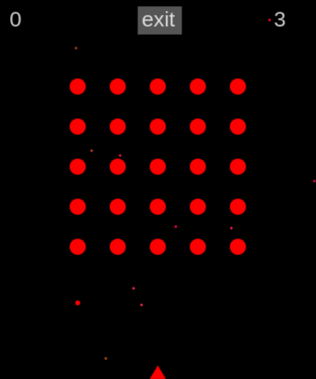

# Alien Invasion #

Alien Invasion is a _very_ simple arcade-style web game made with TypeScript and the HTML Canvas element.

Use the `left`, `right` and `spacebar` keys to shoot the approaching aliens, similar to `Space invaders` from the '80's.



## Getting started ##

You'll need to install [node.js](https://nodejs.org/en/). I used version `20.15.0` but you can install [nvm](https://github.com/nvm-sh/nvm) to easily switch between node.js versions.

Then:

```
git clone git@github.com:scottocorp/alien-invasion.git
cd alien-invasion
npm install
npm run dev
```
and browse http://localhost:3000/

To build:

```
npm run build
```
and deploy the contents of the `/dist` folder to your favorite cloud provider.

Enjoy!

## TODO ##

This is definitely a "minimum viable product". More work is needed to: 
- Make it work on a smartphone.
- Set up a test suite.
- Make better use of TypeScript's interfaces & classes.
- Fix performance issues.
- etc

## Acknowledgements
- I used [Kibo](https://github.com/marquete/kibo) to handle keyboard events.


## License

See [LICENSE.md](./LICENSE.md).
